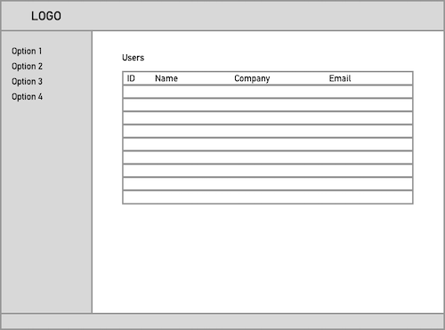

# front-end-exercise

> The purpose of this is to see how front end devs might tackle this task. There is no right or wrong way to structure it. Do your best and have fun.  
This is an empty Vue JS setup

1. Clone this repository

2. Run the build process

    ``` bash
    # install dependencies first time
    npm install
    
    # serve with hot reload at localhost:8080
    npm run dev
    ```
    or
    ```
    # build for production with minification
    npm run build
    ```

3. Use your artistic license to create and style the following wireframe to the best of your ability using HTML, CSS and javascript
    
    
    
    Logos are in `src/assets` and users are in `src/data`

If this is too easy then see if you can use vue components, import the data or even create a mobile response version.
